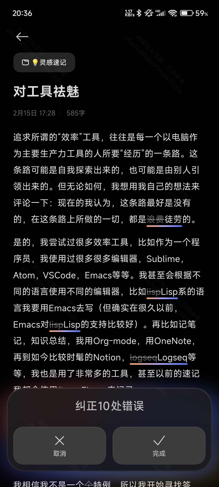

聊聊简化效率工具的这件事。

<!--more-->

追求所谓的“效率”工具，往往是每一个以电脑作为主要生产力工具的人所要“经历”的一条路。这条路可能是自我探索出来的，也可能是由别人引领出来的。但无论如何，
我想用我自己的想法来评论一下：**现在的我认为，这条路最好是没有的，在这条路上所做的一切，都是徒劳的**。

是的，我尝试过很多效率工具，比如作为一个程序员，我使用过很多很多编辑器，Sublime，Atom，VSCode，Emacs 等等。我甚至会根据不同的语言使用不同的编辑器，
比如 Lisp 系的语言我要用 Emacs 去写（但确实在很久以前，Emacs 对 Lisp 的支持比较好）。再比如记笔记，知识总结，我用 Org-mode，用 OneNote，
再到如今比较时髦的 Notion，Logseq 等等，我也是用了非常多的工具，甚至以前的速记我都会使用 Flomo 来记录。

暂且不谈编辑器，这里只聊聊笔记工具。我同时也发现，虽然我在各方面消耗了如此多的精力去撰写我的各种总结与笔记，但每每回想起来，我好像也不怎么会去回顾我的记录，这是为什么呢？

我相信我不是一个特例，所以我开始寻找答案：究竟，我们需要从知识总结、笔记、速记这些东西中获取什么呢？

1. 我需要记下我可能会忘掉的东西。人脑毕竟不是无限容量的存储，就像照片一样，回看照片可以帮助我们回忆起那时发生的事情。
2. 凝练知识，将杂乱的东西总结，以达到融会贯通的目的。

所以，如果我很少去回顾的话，那就证明这个东西，是不是不那么重要？或者说，它已经达到了第二点所说的目的吗？我认为，答案是这两种情况都是存在的。但同时，
我认为我也无法证伪这些记录都是属于无用的或者是已经理解的这两种情况，它们之中也会存在有用的但我忘记的记录。

**那么如果这个逻辑是正确的，运用多个工具反而并不能帮助你什么，甚至还会阻碍你去搜索你想回顾的东西，这是一层人为制造的屏障，每次回顾的前提都是：我把它记在哪儿了？**

这可能也是导致我很少回顾笔记的原因之一，因为惯性。惯性会导致当你在第一次思索我把笔记记在哪里了但没有结果时，记录下此刻的思维模式，从而产生惯性。
使用的工具越多，就可能会更加强化这个惯性（因为工具越多，笔记分散的就越广泛）。

所以最好的做法就是简化你的工具，用 1 个，用 2 个，但是不要用 345678 个。我相信在此时此刻，2025 年，任意一款笔记工具都可以满足记录、存储、搜索的需求。
你可能会追求一款工具的排版能力，亦或者是它有着多么强大的知识整合的功能，但是它们真的都没那么重要。**重点是，能搜索到就可以了**。试想一下，如果你追求工具的功能，
比如你将某些记录的排版搞得特别好，但是假如这些知识是无用的，那不就等于浪费时间吗？

想通了之后，我开始对工具祛魅。当有一些灵感冒出之后，我就使用手机自带的笔记应用去记，从新建笔记到记录下来，用不了几分钟，而且由于每天都要看手机的缘故，
我是不可能忘记我在手机记录的笔记的。假如我正在使用电脑的话，那么就打开 Notion，也是直接新建笔记开始记录，忽略模板，排版，任务这些功能，先记下来再说，
如果以后发现这个东西是有用的，再继续整理也不迟。**我需要保证的只有一个，它能被我在 5 秒钟之内搜索到，这样就可以了**。

另外对于之前的笔记，也不要想着如何迁移过来了。既然已经是很少回顾的东西，那就不要继续浪费时间了。

最后，我还有一个小技巧想说一下，那就是借助 AI 去纠正错别字。比如我在小米笔记中写完之后，只需要点击一下纠正，它便可以帮我发现几乎所有的错别字，
真的很好用。

